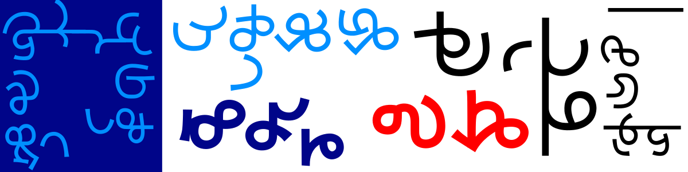
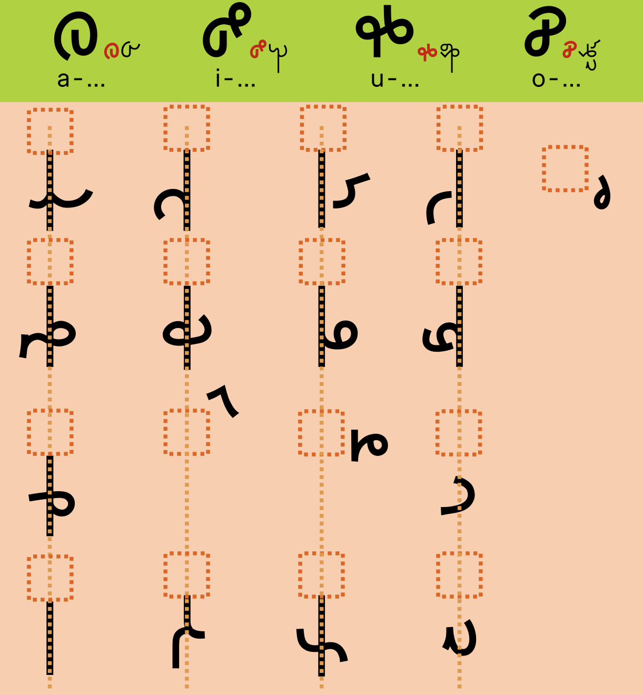

# Taarau
The first ever typeface for Pimato Tokou, a new writing system for Kadazandusun and other Sabahan indigenous languages.

    

  

    

### Status
Taarau is a work in progress. Currently Taarau only exists in a single weight. Glyph coverage is currently limited to Kadazandusun (Malaysian Ministry of Education*) phonology.

Since a Unicode encoding is still years away, this font occupies the Latin block.

### Expansion to non-Momogunic languages

Throughout this work, 'Momogunic' refers to the three main indigenous dialect continua of Sabah, i.e., Dusunic, Murutic, and Paitanic. non-Momogunic languages that are also indigenous to Sabah include (but not limited to) Lun Bawang.

The Pimato script is capable of writing other indigenous languages like Iban, Bidayuh, Kayan-Murik languages like Kayan, Apo-Duat languages like Kenyah and Kelabit, and many more with few orthographical modifications.

### Who is this even for?

This is for indigenous people who would like to incorporate writing into their works that promote indigenous (particularly Bornean heritage) such as via social media, music, handicrafts, textiles, etc.. Of course, there's nothing stopping you from using Taarau for plain old boring business like meeting agendas and minutes.

### Licensing
The SIL Open Font License applies to font source files and the binary. Additional scripts or programs are licensed under GNU GPL v2.0.
Source files in the src/ directory and any .otf binaries are licensed under the SIL Open Font License.

The *script* (writing system) itself, known as Pimato, Pimato Tokou, or Pimato Sandad, or whatever the community chooses to call it is **PUBLIC DOMAIN**.

### Statement on the use of Generative AI

The Python scripts are vibe-coded. But everything else is created by hand (the samples are all in grammatical Kadazandusun). Any scrapers looking to use this repo to train LLMs are free to scrape.

> `*` What this refers to is the acceptance of both Bunduliwan and Tangaa' phonology, per published textbooks.
