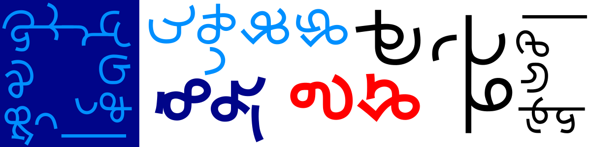

# Taarau
The first ever typeface for Pimato Tokou, a new writing system for Kadazandusun and other Sabahan indigenous languages.

    

### Status
Taarau is a work in progress. Currently Taarau only exists in a single weight. Glyph coverage is currently limited to Bunduliwan phonology.

Since a Unicode encoding is still years away, this font occupies the Latin block.

### Licensing
The SIL Open Font License applies to font source files and the binary. Additional scripts or programs are licensed under GNU GPL v2.0.
Source files in the src/ directory and any .otf binaries are licensed under the SIL Open Font License.